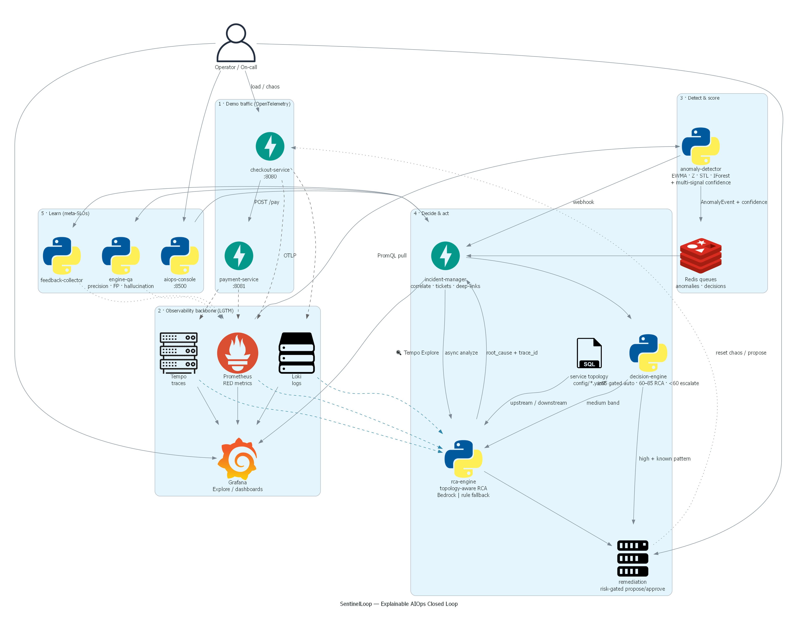
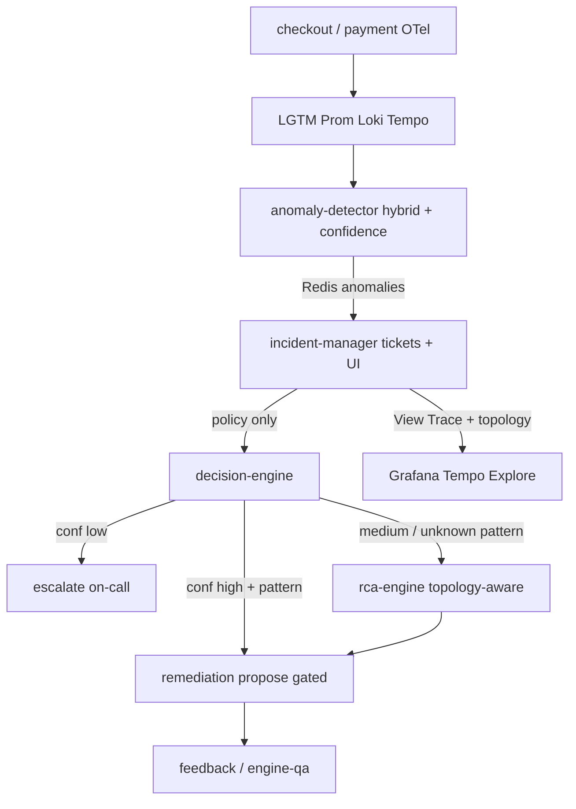

# SentinelLoop

**Explainable AIOps closed loop** — detect → confidence → decide → topology-aware RCA → remediate → learn.

Repo: [`aiops-demo-bedrock`](https://github.com/XUanhoa04/aiops-demo-bedrock)  
[](https://github.com/XUanhoa04/aiops-demo-bedrock/actions/workflows/ci.yml)

Production-*like* portfolio project for senior SRE / Platform / AIOps interviews  
(honest trade-offs in [`docs/ARCHITECTURE.md`](docs/ARCHITECTURE.md)).

> Observability (OTel + Grafana LGTM) → **Explainable** hybrid anomaly detection →  
> Multi-signal **confidence** → **Decision Engine** (auto / RCA / escalate) →  
> **Grounded** Bedrock RCA → **Risk-gated** remediation → Feedback + **Engine QA**.

```bash
cp .env.example .env          # optional AWS keys for Bedrock
docker compose up -d --build
bash scripts/wait_for_stack.sh
python scripts/demo_one_shot.py   # recommended one-shot path
# Open: http://localhost:8500  ·  Grafana http://localhost:3000
```

Without AWS keys, RCA still runs via **rule-based fallback** (safety over silence).  
Offline quality gates (no Docker required for unit/eval): `bash scripts/run-evaluation.sh` or `make ci`.

---

## Why this project (for hiring managers)

| Senior bar | Implementation |
|------------|----------------|
| **Safety** | High-risk restart/scale need approval; optional `REMEDIATION_API_KEY`; Bedrock → rule fallback |
| **Explainability** | Detector emits sigma/EWMA sentences, not only opaque scores |
| **Grounded GenAI** | RCA only reasons over Prom/Loki/Tempo evidence + strict JSON schema |
| **Single control plane** | Decision Engine owns RCA/remediate/escalate (IM does not always call LLM) |
| **Time-to-evidence** | Incident UI **🔍 View Trace** + topology panel deep-links Grafana Tempo |
| **Closed loop** | Feedback metrics (`feedback_positive_rate`, `rca_accuracy_estimate`, `false_positive_count`) |
| **Operate-ability** | One compose file, healthchecks, non-root images, log rotation |
| **Measurable quality** | Offline anomaly F1 + RCA accuracy (stricter scoring) + **baseline beat** in CI |

### Production trade-offs (not oversold)

This is a **laptop-friendly demo**, not a multi-tenant SaaS. Deliberately simplified:

| Demo | Production would use |
|------|----------------------|
| Redis LIST queues | Kafka / SQS / Streams + DLQ |
| SQLite tickets | Postgres + migrations |
| In-memory detector windows | Feature store / stream processor |
| Optional API key on remediate | SSO + RBAC on approve/execute |

Full diagram & decision rationale: **[`docs/ARCHITECTURE.md`](docs/ARCHITECTURE.md)**.

---

## Architecture

Full diagram ([diagrams.mingrammer.com](https://diagrams.mingrammer.com/)) — see also [`docs/ARCHITECTURE.md`](docs/ARCHITECTURE.md):



```bash
# Regenerate PNG (needs Graphviz + pip install diagrams)
python docs/generate_architecture_diagram.py
```

### Control plane (Mermaid)



**Invariant:** RCA/LLM is invoked by **Decision Engine**, not on every ticket.
Set `ENABLE_DIRECT_RCA_FANOUT=true` only for legacy dual-path demos.

### Pipeline stages

1. **Observability** — Apps export OTLP to LGTM (metrics + traces; logs when available).
2. **Anomaly detection** — Hybrid EWMA/z-score/STL + IsolationForest; multi-signal confidence 0–100.
3. **Correlation & incident** — Same service+metric window → one ticket (noise control).
4. **Decision Engine** — conf≥85 + known pattern → gated remediate; 60–85 → RCA/LLM; &lt;60 → escalate.
5. **RCA** — Evidence pack + topology neighbors; Bedrock `converse()` + JSON schema; rule fallback.
6. **Remediation** — Low-risk auto (e.g. clear chaos); high-risk (restart/scale) needs approval (+ optional API key).
7. **Feedback / Engine QA** — Thumbs + precision/FP/hallucination gauges + tuning advice.

---

## Trace experience (standout feature)

From **http://localhost:8002/** open an incident → **🔍 View Trace**:

- If RCA found Tempo traces → opens Grafana Explore on the **primary slow/error trace id**.
- Else → service-scoped TraceQL (`status=error`) so the operator still lands in context.
- Also: **Logs** deep-link (Loki) + **Service topology** panel (`GET /incidents/{id}/topology`).

API for bots/Slack:

```bash
curl -s http://localhost:8002/incidents/<id>/observability-links | jq .
curl -s http://localhost:8002/incidents/<id>/topology | jq .
```

**Why deep-link?** On-call time is the scarce resource. Copy-pasting trace IDs is swivel-chair toil and error-prone.

---

## Explainability (anomaly + confidence)

Example detector message (stored on the ticket):

> `[ewma_zscore, threshold] error rate cao hơn 3.21 sigma so với EWMA baseline 0.03 (α=0.3, …) | error rate=0.45 breached absolute threshold 0.15`

Design choice: **hybrid** — EWMA/Z-score (+ STL when seasonality is strong) for auditability; IsolationForest for multivariate joint outliers; absolute thresholds for cold-start safety.

**Confidence Scoring Engine** (0–100) weights multi-signal context for the Decision Engine:

| Signal  | Default weight | Why |
|---------|----------------|-----|
| Metrics | 40% | Detector is metric-driven; always present if we fired |
| Traces  | 30% | Best causal link for RCA (which span failed) |
| Logs    | 20% | Message-level corroboration |
| Events  | 10% | Deploy/chaos/change correlation (sparse) |

Missing `trace_id` / logs / metrics subtracts points. Prometheus exposes `anomaly_confidence_score` and `context_completeness`. Full object: `GET /decisions`, `POST /detect` → `decision`.

### Decision Engine (port 8006)

| Confidence / condition | Action |
|------------------------|--------|
| ≥ 85 + known pattern | **Auto-remediate (gated)** — log + propose, no force-execute |
| 60–85 | **Bedrock RCA** (limited) + suggestions for on-call |
| < 60 or critical missing context | **Escalate** on-call with explanation |
| Max 2–3 iterations exhausted | Forced handoff |

Details: `aiops-services/decision-engine/README.md` · `GET /decision-table`

### Engine QA (port 8007 / UI 8503)

“Supervise the supervisors” — on-call rates **anomaly · confidence · RCA · decision**, then aggregates:

- Precision / recall *estimate*, false-positive rate  
- LLM hallucination rate  
- Mean decision iterations before handoff  
- **Advisory** confidence-weight & threshold tuning (never auto-applied)

UI: http://localhost:8503 · API: `POST /qa/reviews`, `GET /qa/metrics`, `GET /qa/tuning/report`

---

## Ports

| Component | Port | Notes |
|-----------|------|--------|
| Grafana | 3000 | Import `observability/grafana/dashboards/aiops-engine-health.json` |
| OTLP | 4317 / 4318 | Prefer HTTP 4318 for demos |
| Prometheus | 9090 | PromQL source for detector + RCA |
| Loki / Tempo | 3100 / 3200 | Evidence + deep-links |
| checkout / payment | 8080 / 8081 | Chaos-capable demo apps |
| anomaly-detector | 8001 | `/detect`, `/metrics` |
| incident-manager | **8002** | Console + tickets |
| rca-engine | 8003 | `/analyze-incident/{id}` |
| remediation | 8004 + **8501** UI | Approve & execute |
| feedback | 8005 + **8502** UI | On-call review |
| **decision-engine** | **8006** | Confidence-gated routing (see decision table) |
| **engine-qa** | **8007** + **8503** UI | Meta-QA: precision/FP/hallucination/tuning |
| **AIOps Console** | **8500** | Unified Streamlit: Incidents + Health |

---

## Setup (one command)

```bash
cp .env.example .env
# Optional Bedrock:
#   AWS_ACCESS_KEY_ID / AWS_SECRET_ACCESS_KEY / BEDROCK_MODEL_ID=amazon.nova-lite-v1:0

docker compose up -d --build
```

---

## How to Generate Dynamic Load & Anomalies

Telemetry must **change over time** so EWMA/STL/IsolationForest and Loki/Tempo stay realistic.

### Multi-stage load (recommended)

```bash
# Stages: normal → traffic spike → error injection → latency injection → recovery
python scripts/dynamic_load.py --profile demo
# shorter stages:
python scripts/dynamic_load.py --profile demo --stage-seconds 15
```

Each stage POSTs `/chaos` on checkout/payment (`error_rate`, `extra_latency_ms`, **`fault_mode`**) and drives concurrent `/checkout` traffic so RED metrics, error logs, and traces move together.

### Single chaos knobs

```bash
python scripts/chaos.py --service payment --error-rate 0.4 --fault-mode db_pool
python scripts/chaos.py --service checkout --extra-latency-ms 1200 --fault-mode cache_miss
python scripts/chaos.py --reset
```

### Scenario from evaluation dataset

```bash
python scripts/run_scenario.py --list
python scripts/run_scenario.py --scenario rca-01-payment-db-pool --duration 45
```

Then watch: Grafana `:3000`, detector `:8001/results`, incidents `:8002`.

Fault modes emit production-like log lines, e.g. *database connection pool exhaustion*, *cache miss storm*.

---

## How to Run RCA Evaluation

Mini ground-truth set: **10 RCA scenarios** + **8 anomaly series** under `evaluation/`.

```bash
# One command — offline anomaly + RCA (no AWS required)
bash scripts/run-evaluation.sh

# With live stack RCA API:
bash scripts/run-evaluation.sh --online

# Plus dynamic load after scoring:
bash scripts/run-evaluation.sh --with-load
```

Or step-by-step:

```bash
pip install pyyaml
python evaluation/evaluate_anomaly.py
python evaluation/evaluate_rca.py --mode offline
# optional Bedrock:
python evaluation/evaluate_rca.py --mode offline --bedrock
python evaluation/evaluate_rca.py --mode online
```

### Sample evaluation results (offline)

| Suite | Metric | Notes |
|-------|--------|--------|
| **Anomaly** (~20, core+holdout) | Overall F1 ≥ 0.70; **core** F1 ≥ 0.75 | Uni + seasonal + multivariate IF |
| **RCA** (~30, core+holdout) | Overall ≥ 0.70; **holdout** ≥ 0.55 | Multi-hop, partial backends, paraphrase — regression gate |
| **Baselines** | System must **beat** random / always-error / empty | Prevents “dataset overfit” theater |

Scoring requires fault-class agreement and wrong-hop service guards. Report **core vs holdout** separately — do not sell a single accuracy as production quality.

```bash
bash scripts/run-evaluation.sh
python evaluation/evaluate_baselines.py --require-beats-baselines
```

Artifacts: `evaluation/results/{anomaly,rca,baselines}_latest.json`.  
Definitions: [`evaluation/README.md`](evaluation/README.md).

### One-shot demo (for your video)

```bash
docker compose up -d --build
bash scripts/wait_for_stack.sh
python scripts/demo_one_shot.py
# then record: Console :8500 · Incident :8002 · Grafana :3000
```

Wait ~1–2 min first boot (LGTM). Then:

```bash
python scripts/demo_story.py          # narrative + prints Trace URL
# or
python scripts/demo_e2e.py
python scripts/generate_incident.py --full
```

---

## How to demo (3–5 minutes)

Full talk track: **[docs/DEMO_STORY.md](docs/DEMO_STORY.md)** · Video shot list: **[scripts/DEMO_VIDEO.md](scripts/DEMO_VIDEO.md)**

| Minute | Action |
|--------|--------|
| 0:00 | Architecture Mermaid + pitch |
| 0:30 | `python scripts/demo_story.py` |
| 1:30 | Incident Console — explanation column |
| 2:00 | Click **🔍 View Trace** → Grafana Tempo + topology panel |
| 2:40 | Remediation UI risk gates (+ optional API key) |
| 3:10 | Feedback thumbs + `/metrics` quality |
| 3:40 | Production upgrades (Kafka, Postgres, outbox) |

---

## Project layout

```text
aiops-demo-bedrock/
├── docker-compose.yml
├── .env.example
├── apps/                      # OTel-emitting demo services (+ chaos)
├── aiops-services/
│   ├── anomaly-detector/      # hybrid + confidence
│   ├── incident-manager/      # tickets + trace/topology console
│   ├── decision-engine/       # single control plane (auto/RCA/escalate)
│   ├── rca-engine/            # topology-aware Bedrock RCA + rules
│   ├── remediation/           # gated actions + optional API key
│   ├── feedback-collector/    # review loop
│   ├── engine-qa/             # meta precision / hallucination
│   └── aiops-console/         # unified Streamlit
├── config/service_topology.yaml
├── evaluation/                # offline RCA + anomaly + baselines
├── shared/aiops_shared/       # models, topology, OTEL, grafana_links
├── observability/
├── docs/
└── scripts/
```

---

## Production notes (interview depth)

| Demo choice | Why | Production evolution |
|-------------|-----|----------------------|
| Prom **pull** detection | Isolate blast radius; same queries as humans | Stream processor / remote_write for scale |
| Redis LIST | Teach detect→act; zero ops | Kafka/SQS + DLQ + consumer groups |
| SQLite WAL | Laptop CV demo | Postgres multi-AZ + PITR |
| Async RCA webhook | Don't block ticket path on LLM latency | Outbox + workers + retries |
| Grounded JSON RCA | Prevent hallucination | Schema registry + eval harness |
| Risk gates | Prevent runaway automation | Change freezes, dual control, policy engine |
| Feedback gauges | AIOps must observe itself | Retrain/detector calibration pipelines |

### What we intentionally did **not** do

- Auto-restart everything on every alert  
- Ungrounded “ChatGPT ops” from the ticket title alone  
- Hiding ML scores without an English explanation  
- Multi-GB full OpenTelemetry Demo by default (apps/ stand-in keeps the laptop usable; LGTM remains the real backbone)

---

## Configuration highlights

| Env | Purpose |
|-----|---------|
| `GRAFANA_PUBLIC_URL` | Browser URL for Trace buttons (`http://localhost:3000`) |
| `TEMPO_DATASOURCE_UID` / `LOKI_DATASOURCE_UID` | Grafana datasource UIDs for Explore links |
| `BEDROCK_MODEL_ID` | Default `amazon.nova-lite-v1:0` |
| `RCA_ENGINE_URL` | Incident → RCA |
| `REMEDIATION_URL` | RCA → propose actions |
| `ZSCORE_THRESHOLD` / `ERROR_RATE_THRESHOLD` | Detector sensitivity |

---

## Troubleshooting

```bash
docker compose ps
docker compose logs -f aiops-anomaly-detector aiops-incident-manager aiops-rca-engine
curl -s http://localhost:8002/incidents?limit=1 | jq .
curl -s http://localhost:8002/incidents/<id>/observability-links | jq .
```

| Issue | Fix |
|-------|-----|
| Trace button opens empty Explore | Confirm Tempo has traces (generate load); check datasource UID in Grafana |
| RCA always rule-based | Set AWS keys; use an enabled model id |
| Port conflicts | Free 3000/9090/8001–8005/8501–8502 |

---

## License

MIT — portfolio / workshop use. Never commit `.env` secrets.
