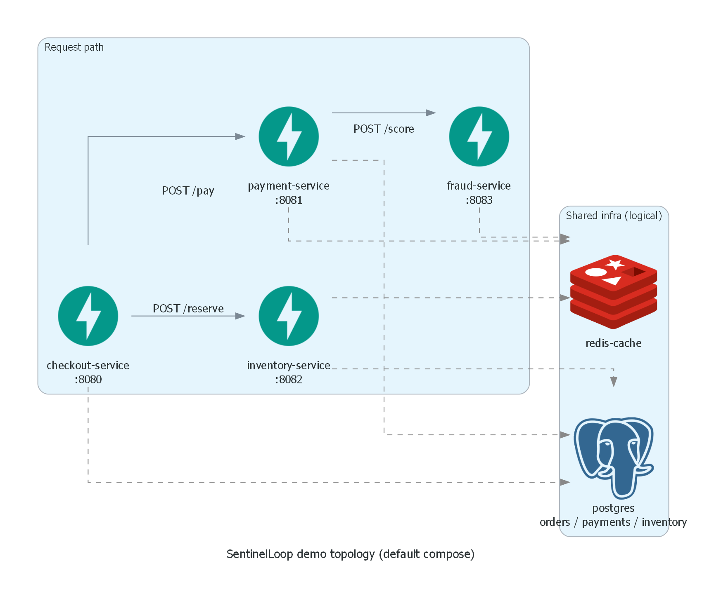

# Architecture & production trade-offs

Honest companion to the README: what we built, why, and what is deliberately *not* production.

## System diagram


Sources:

- Graphviz: [`architecture-sentinel-loop.dot`](architecture-sentinel-loop.dot)
- Python (optional): [`generate_architecture_diagram.py`](generate_architecture_diagram.py)

```bash
# Graphviz (recommended)
dot -Tpng -Gdpi=150 -o docs/architecture-sentinel-loop.png docs/architecture-sentinel-loop.dot
dot -Tpng -Gdpi=150 -o docs/topology-demo-apps.png docs/topology-demo-apps.dot

# or diagrams.mingrammer.com (needs Graphviz + pip install diagrams)
python docs/generate_architecture_diagram.py
python docs/generate_topology_diagram.py
```

## Demo app topology



```text
checkout-service (:8080)
  ├─► inventory-service (:8082)   stock reserve
  └─► payment-service   (:8081)
        └─► fraud-service (:8083) scoring
```

Catalog: `config/service_topology.yaml`.  
Optional multi-tenant-scale graph: Astronomy Shop — [`OTEL_DEMO.md`](OTEL_DEMO.md).

## Pipeline (logical)

```
checkout → inventory
   └────► payment → fraud     (OTel → LGTM)
              │
              ▼
         LGTM (Prom / Loki / Tempo)
              │ PromQL pull
              ▼
 anomaly-detector ── hybrid score + multi-signal confidence
              │ Redis: aiops:anomalies
              ▼
 incident-manager (tickets, correlation, topology UI, Trace deep-links)
              │
              ▼  ★ single control plane (default)
 decision-engine (policy: auto / RCA / escalate)
              │
              ├ conf < 60 ──────────────► escalate (no LLM)
              ├ conf ≥ 85 + pattern ────► remediation propose (gated, no force)
              └ medium / high no-pattern ► rca-engine
                                            ├ topology neighbors
                                            ├ config/rca_patterns.yaml
                                            └ Bedrock | rule fallback
                                                  │
                                                  ▼
                                            remediation (risk-gated + optional API key)
                                                  │
                                                  ▼
                                            feedback / engine-qa
```

**Control-plane invariant:** Incident Manager does **not** call RCA by default.  
`ENABLE_DIRECT_RCA_FANOUT=true` restores the legacy dual path.  
RCA Redis poll defaults **off**.

## Topology (RCA)

**Default:** 4 running apps + static catalog (+ Tempo-inferred edges).

At gather time RCA expands **upstream/downstream** neighbors into `EvidencePack` and prefers a sicker dependency as `root_cause` when margins match (wrong-hop avoidance).

**Rule patterns** are data-driven: `config/rca_patterns.yaml` via `aiops_shared.rca_patterns` — extend synonyms in YAML, not `if scenario_id` in Python.

## Why these algorithms & weights

| Choice | Rationale |
|--------|-----------|
| EWMA + Z-score | Explainable to on-call (“2.8σ above EWMA”); works with short windows |
| STL (optional) | Avoid diurnal false positives when seasonality strength is real |
| IsolationForest | Joint RED outliers rules miss; contamination~0.08 for mostly-healthy demos |
| Confidence 40/30/20/10 (metrics/traces/logs/events) | Detector is metric-first; traces beat logs for RCA; events sparse |
| Decision bands 85 / 60 | High conf + known pattern → gated remediate; medium → LLM; low → escalate |
| Bedrock only on medium band | Cost control — don’t spend tokens on obvious chaos resets or empty context |
| Config pattern catalog | Ops can add fault synonyms without code; still explainable rules |

## What is demo-grade (not full prod)

| Area | Demo choice | Production direction |
|------|-------------|----------------------|
| Queue | Redis LIST LPUSH/BRPOP | Kafka / SQS / Redis Streams + consumer groups + DLQ |
| Tickets | SQLite file volume | Postgres / Jira / PagerDuty |
| Detector state | In-process deques | Feature store / stream processor; survive restarts |
| Auth | Optional `REMEDIATION_API_KEY`; open localhost APIs | mTLS, SSO, RBAC on approve/execute |
| Multi-tenant | Single compose network | Namespace isolation, per-tenant quotas |
| Topology | 4-app YAML + optional Astronomy Shop | Mesh/CMDB service graph + continuous discovery |
| Eval dataset | ~42 RCA + ~28 anomaly (core/holdout) | Larger labeled set + shadow traffic + human agreement |
| Auto-remediation | Propose / low-risk chaos reset only | Change windows, canary, automated rollback |

## Safety invariants (keep these)

1. High-risk remediation (restart/scale) requires human approval.
2. Decision Engine **gated** auto path never force-executes.
3. RCA fails open to **rule-based** fallback — never silent black-hole.
4. Confidence penalties when critical context is missing.
5. Offline evaluation must **beat naive baselines** in CI.

## Sequence: one anomaly

1. Prom scrape → hybrid methods vote → explanation string.
2. Context gather (parallel Prom/Loki/Tempo) → completeness ratio.
3. Confidence scorer → 0–100 + breakdown.
4. Publish AnomalyEvent (context embeds confidence for Decision Engine).
5. IM correlates → ticket; Decision Engine routes.
6. Medium band → RCA (evidence + topology + patterns / Bedrock).
7. On-call reviews in Feedback / Engine QA → precision / hallucination / tuning advice.

## Evaluation honesty

See [`EVALUATION.md`](EVALUATION.md).

- Offline RCA uses the same **config-driven** `rule_based_rca` path as production fallback.
- Report **core vs holdout**; optional `--compare` for rule vs Bedrock.
- Live e2e: `evaluation/evaluate_live_e2e.py` (real chaos + OTel).
- High offline scores = regression coverage of the catalog, **not** learned ML perfection.

## Optional modes

| Mode | How | When |
|------|-----|------|
| **Default 4-app** | `docker compose up -d --build` | CI, daily demo, multi-hop topology |
| **Astronomy Shop** | `scripts/astronomy/start.ps1` | Full OTel Demo (~12 services) |
| **Legacy dual RCA fan-out** | `ENABLE_DIRECT_RCA_FANOUT=true` | Debug only |
